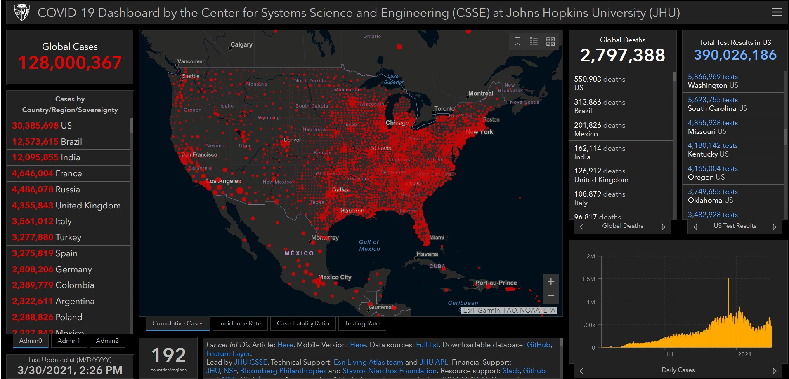

# Week 1 Thinking cap assignment

https://www.arcgis.com/apps/opsdashboard/index.html#/bda7594740fd40299423467b48e9ecf6

-Last Spring Quarter was one of our first instances of being put under lockdown. During that time, many of us probably used this website to gauge how the pandemic would spread.
-In my opinion, this website is supposed to let the user keep track of how Covid-19 spreads in their own regions compared to the rest of the world.
-It speaks to me because it brought global awareness about the pandemic and it helped me decide to leave campus before campus officially shut down,.
-The technologies used are ArcGis and EmberJS i18n.
-One of the things I would change would be having a light mode for people who might be visually impaired and can't read the information due to the red on the black background.
